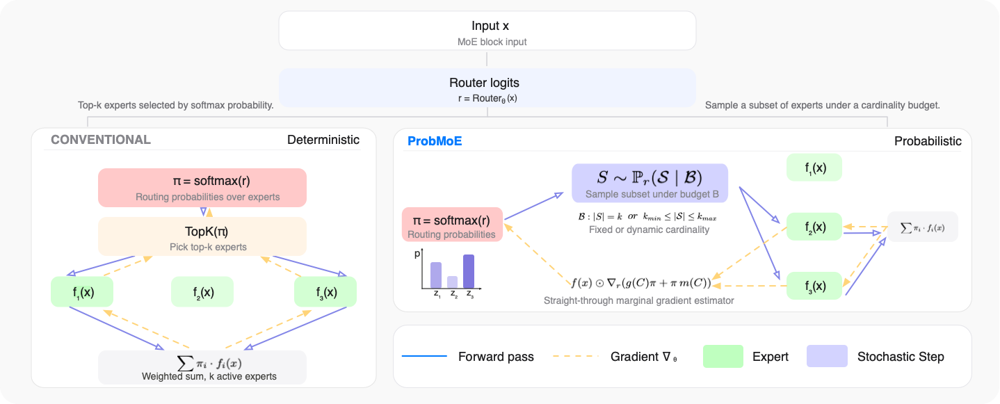

<h1 align="center">✨ ProbMoE ✨</h1>
<p align="center">
  
  
</p>

This is the official repository for the paper: ProbMoE: Differentiable Probabilistic Routing for Mixture-of-Experts

## 📄 Overview

Mixture-of-Experts (MoE) models scale by activating only a small subset of experts per token. However, training such models remains challenging because top-*k* routing is discrete and non-differentiable, requiring gradient estimators for expert selection whose design remains a central open problem. We introduce ProbMoE, a probabilistic routing framework that models expert selection as a distribution over cardinality-constrained expert subsets and formulates routing as probabilistic inference in this discrete subset space. To optimize this formulation, ProbMoE adopts [SIMPLE](https://openreview.net/forum?id=q3KCXh0Mug) (Ahmed et al., 2023), a gradient estimator for cardinality-constrained subset distributions.

- **ProbMoE Exact-*k*** — samples discrete *k*-expert subsets in the forward pass, with the backward pass propagating gradients through each expert's exact marginal probability as a tractable surrogate for the true gradient.
- **ProbMoE Dynamic-*k*** — generalizes Exact-*k* so that both training and inference constrain routing cardinality to the same predefined range, allowing adaptive expert allocation per token.

Across benchmarks on **OLMoE** and **Qwen-MoE** backbones, ProbMoE Exact-*k* improves expert utilization and routing diversity over competitive baselines, and Dynamic-*k* achieves comparable performance with fewer activated experts.



> **Comparison of conventional Top-$k$ training and ProbMoE training.** **Left:** **Conventional** MoE applies a deterministic top-$k$ operator to the softmax routing probabilities for expert selection, while propagating gradients only through these probabilities. **Right:** **ProbMoE** models expert routing as probabilistic inference over discrete expert subsets. ProbMoE samples an expert subset $S$ from a cardinality-constrained distribution. Let $z$ denote the binary mask of the sampled subset and let $m$ denote the corresponding expert-selection marginals. Gradients are propagated through the straight-through mask $g=stopgrad(z-m)+m$, which is combined with the softmax routing probabilities to form the final routing weights. This yields informative router gradients while preserving sparse expert execution. ProbMoE Dynamic-$k$ allows the subset size to vary within a range, with ProbMoE Exact-$k$ recovered as a special case.

---

## 📁 Repository Layout

```
ProbMoE/
├── train/         # Finetuning pipelines
│   ├── olmoe/     # open-instruct pipeline with framework-local OLMoE blocks
│   └── qwen/      # LLaMA-Factory pipeline with framework-local Qwen blocks
└── eval/          # Task-specific evaluation
    ├── gsm/       # GSM8K math reasoning
    ├── mbpp/      # MBPP code benchmark
    └── esft/      # ESFT domain benchmarks (Law, Summary, Translation)
```

---

## 🚀 Quickstart

### 1️⃣ OLMoE-1B-7B

The OLMoE pipeline is built on top of [open-instruct](train/olmoe/open_instruct/) and supports GSM, Law, Summary, Translation, and CodeAlpaca. Fixed-*k* launchers cover every task; dynamic-*k* launchers are provided for GSM, Law, Translation, and CodeAlpaca.

```bash
conda create -n openinstruct python=3.12 -y
conda activate openinstruct
cd train/olmoe/open_instruct
bash init_env.sh

cd ../script
export WANDB_API_KEY=...               # optional when W&B is disabled
bash train_ProbMoE_OLMoE_exact.sh gsm  # fixed-k
bash train_ProbMoE_OLMoE_dynamic.sh gsm # dynamic-k
```

Full instructions: [train/olmoe/README.md](train/olmoe/README.md).

### 2️⃣ Qwen1.5-MoE-A2.7B

The Qwen pipeline is built on top of [LLaMA-Factory](train/qwen/LLaMA-Factory/) with the same fixed-*k* task coverage and dynamic-*k* launchers for GSM, Law, and Translation.

```bash
conda create -n lmfact_env python=3.12 -y
conda activate lmfact_env
cd train/qwen/LLaMA-Factory
pip install -e ".[torch,metrics]"
pip install transformers==4.51.3 deepspeed==0.16.7 wandb

cd ../scripts
export WANDB_API_KEY=...               # optional when W&B is disabled
bash train_ProbMoE_qwen_exact.sh gsm   # fixed-k
bash train_ProbMoE_qwen_dynamic.sh gsm # dynamic-k
```

Full instructions: [train/qwen/README.md](train/qwen/README.md).

### 3️⃣ Evaluation

Task-specific evaluation scripts (GSM8K, MBPP, ESFT) live under [eval/](eval/). See [eval/README.md](eval/README.md).

---

## 🤗 Pretrained Checkpoints

If you would rather not finetune locally, we release ProbMoE-finetuned checkpoints on the Hugging Face Hub. Each checkpoint can be loaded directly with `transformers` (set `trust_remote_code=True` if required by the base model) and evaluated using the scripts under [eval/](eval/).

| Backbone | Task | Seed | Checkpoint |
|---|---|---|---|
| Qwen1.5-MoE-A2.7B | GSM8K | 42 | [Hayougewr/qwen1.5-moe-a2.7b-ProbMoE-gsm-ft-seed42](https://huggingface.co/Hayougewr/qwen1.5-moe-a2.7b-ProbMoE-gsm-ft-seed42) |
| Qwen1.5-MoE-A2.7B | CodeAlpaca | 42 | [Hayougewr/qwen1.5-moe-a2.7b-ProbMoE-codealpaca-ft-seed42](https://huggingface.co/Hayougewr/qwen1.5-moe-a2.7b-ProbMoE-codealpaca-ft-seed42) |
| OLMoE-1B-7B | GSM8K | 42 | [Hayougewr/olmoe-ProbMoE-gsm-ft-seed42](https://huggingface.co/Hayougewr/olmoe-ProbMoE-gsm-ft-seed42) |
| OLMoE-1B-7B | CodeAlpaca | 42 | [Hayougewr/olmoe-ProbMoE-codealpaca-ft-seed42](https://huggingface.co/Hayougewr/olmoe-ProbMoE-codealpaca-ft-seed42) |

```python
from eval.probmoe import patch_probmoe_block
from transformers import AutoModelForCausalLM, AutoTokenizer

repo = "Hayougewr/qwen1.5-moe-a2.7b-ProbMoE-gsm-ft-seed42"
patch_probmoe_block("qwen", "exact")
tok = AutoTokenizer.from_pretrained(repo)
model = AutoModelForCausalLM.from_pretrained(repo, trust_remote_code=True)
```

---

## 🔀 Routing Modes

| Mode | Flag | Behavior |
|---|---|---|
| **Exact-*k*** | `band_k = false` | Samples a *k*-subset of experts per token; gradients flow through each expert's exact marginal probability. |
| **Dynamic-*k*** | `band_k = true` with `min_k`, `max_k` | Samples cardinality from `[min_k, max_k]` per token at both training and inference time. |

To enable ProbMoE, set `probmoe: true` in a Qwen YAML config or pass `--probmoe True` to the OLMoE launcher. The blocks are imported directly from their framework-local packages; no external source path is required. A successful patch logs a line of the form:

```
Found ProbMoE block: model.layers.0.mlp - Type: <class 'OLMoE.v1.ProbMoE_V1_olmoe_dynamic.ProbMoEOlmoeSparseMoeBlock'>
```

---

## ✅ Supported Tasks

| Task | OLMoE | Qwen1.5-MoE |
|---|:-:|:-:|
| GSM8K (math) | ✓ | ✓ |
| ESFT-Law | ✓ | ✓ |
| ESFT-Summary | ✓ | ✓ |
| ESFT-Translation | ✓ | ✓ |
| CodeAlpaca | ✓ | ✓ |

---

## 📚 Citation

If you use ProbMoE in your research, please cite our paper:

```bibtex
@inproceedings{
zhao2026probmoe,
title={ProbMoE: Differentiable Probabilistic Routing for Mixture-of-Experts},
author={Heng Zhao and Zilei Shao and Guy Van den Broeck and Zhe Zeng},
booktitle={Forty-third International Conference on Machine Learning},
year={2026},
url={https://openreview.net/forum?id=7zOtnPt85B}
}
```

---

## 🙏 Acknowledgements


- **OLMoE-1B-7B** — [allenai/OLMoE-1B-7B-0125](https://huggingface.co/allenai/OLMoE-1B-7B-0125)
- **Qwen1.5-MoE-A2.7B** — [Qwen/Qwen1.5-MoE-A2.7B](https://huggingface.co/Qwen/Qwen1.5-MoE-A2.7B)
- **open-instruct** — [allenai/open-instruct](https://github.com/allenai/open-instruct)
- **LLaMA-Factory** — [hiyouga/LLaMA-Factory](https://github.com/hiyouga/LLaMA-Factory)
- **ESFT** — [deepseek-ai/ESFT](https://github.com/deepseek-ai/ESFT)
- **GSM8K** — Cobbe et al., 2021. [openai/grade-school-math](https://github.com/openai/grade-school-math) · [Paper](https://arxiv.org/abs/2110.14168)

The repository is based on [DenseMixer](https://github.com/yaof20/DenseMixer).
 
---

## 📧 Contact

For questions about the code or paper, contact [Heng Zhao](mailto:qgg5se@virginia.edu) 
